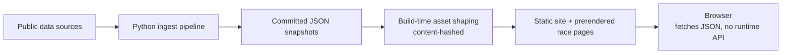

# CampaignWatch_Architecture

Architecture notes and diagrams for **Campaign Watch** — a static, map-first
exploration tool for the 2026 U.S. Senate and House races.

This repo is documentation only. It holds the design reasoning and the diagrams;
the application code lives elsewhere.

## Contents

| Path | What's in it |
| --- | --- |
| [`decisions/`](decisions/) | One file per architectural decision — context, choice, trade-offs |
| [`diagrams/`](diagrams/) | Mermaid / C4 source and exported images |

## System at a glance



## Key design choices

- **Fully static, no application server.** Every race, candidate, finance total
  and historical result is precomputed and committed; the browser fetches JSON
  and nothing else.
- **Precompute over query.** Cost and latency move to build time instead of
  request time.
- **Map as the primary navigation surface**, with URL-addressable selection
  state so every race has a real, shareable, prerendered page.
- **Lazily loaded search index**, fetched only once a query reaches two
  characters, so it costs nothing on initial load.

_Each of these gets its own writeup under `decisions/`._

## Decision record template

```markdown
# <Title>

**Status:** proposed | accepted | superseded
**Date:** YYYY-MM-DD

## Context
What forced a decision.

## Decision
What was chosen.

## Consequences
What this bought, and what it cost.
```
